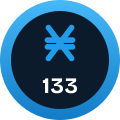

# nano133 Kit

Practical, open-source Nano (XNO) tools for websites, from what
[nano133.com](https://nano133.com) runs. Each tool comes with a package, an
AI setup prompt and spec, and manual steps.

| Tool | Where | On npm | Stage |
|---|---|---|---|
| Nano Checkout | [`@nano133/checkout`](packages/checkout) | [0.2.1](https://www.npmjs.com/package/@nano133/checkout) | Beta |
| Late Payment Return | [`@nano133/late-returns`](packages/late-returns) | [0.3.0](https://www.npmjs.com/package/@nano133/late-returns) | Beta |
| Sign in with Nano | [`@nano133/signin`](packages/signin) | [0.2.0](https://www.npmjs.com/package/@nano133/signin) | Alpha |
| Nano Unlock for Next.js | [`nano133-com/nano-unlock-next`](https://github.com/nano133-com/nano-unlock-next): the package `@nano133/unlock` and a blog; runs on Vercel and on Cloudflare Workers (live demos: [Vercel](https://nano-unlock-next.vercel.app), [Cloudflare](https://nano-unlock-blog.nano133.workers.dev)) | [0.1.1](https://www.npmjs.com/package/@nano133/unlock) | Alpha |
| Nano Unlock for WordPress | [`nano133-com/nano-unlock`](https://github.com/nano133-com/nano-unlock): a plugin | not an npm package | Alpha |

What a stage means: [nano133.com/stages](https://nano133.com/stages).

Set it up with AI: see `AGENTS.md`, or the Claude Code skills in `skills/`.

MIT license.
